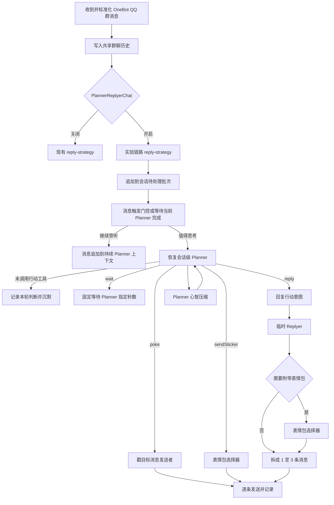

# 技术方案

## 实验性聊天链路

### 背景

当前聊天链路已经具备会话历史、滚动摘要、记忆检索、回复判断、同会话旧请求取消、消息批次和按换行逐条发送等能力，但仍存在以下边界问题：

- 普通消息使用从第一条消息开始计算的固定等待窗口，不是跟随聊天节奏变化的静默窗口。
- 新的普通消息只会进入等待批次，不会立即使正在生成的旧回复失效，旧回复可能在话题变化后发出。
- 同一次 LLM 调用既判断是否参与，又调用工具并生成用户可见正文，内部决策和角色表达没有隔离。
- 消息条数由模型换行决定，模型同时承担语义生成和发送节奏控制。
- `chat()` 与 `chatBatch()` 主流程重复，实验行为与原聊天生成逻辑耦合。

本方案借鉴 MaiBot 的消息触发、持续 Planner 上下文、Planner/Replyer 分离和回复拆句思想，但不在现有聊天链路上直接重构。新增一套独立实验链路，通过实验参数在入口处选择旧链路或新链路，以便对比真实聊天效果并保证旧行为可随时恢复。

本实验以拟人化效果为最高优先级。调用次数、上下文长度、实现复杂度和响应时间是需要观测的约束，但不能为了降低这些成本，把 Planner 退化成每次收到消息后重新执行的无状态回复分类器。架构首先要保证悠酱具有连续的注意力、态度、参与节奏和表达动机。

### 目标

- 完整保留旧聊天链路及其现有行为。
- 为 OneBot QQ 群聊新增独立的消息触发、Planner、Replyer、回复拆句和发送编排链路。
- 使用一个实验参数在 QQ 群聊的旧链路和新链路之间二选一。
- 未触发 Planner 的群聊消息仍进入真实会话历史，后续批次可以读取。
- 为每个会话维护持续的 Planner 心智上下文，使观察、等待、工具查询、沉默和回复形成连续过程。
- 当前相关人物的长期画像由程序在每次 Planner 请求前稳定注入，不依赖 Planner 主动检索。
- Planner 上下文达到 token 阈值后，按主观连续性进行压缩，而不是只总结聊天事实。
- 新消息到达时不打断正在运行的 Planner；消息进入下一待处理批次，Replyer 和尚未发送的分段仍可因新消息失效。
- Planner 独占工具调用和参与决策，Replyer 只负责生成用户可见表达。
- 表情包作为独立社交行动由 Planner 决定，具体资源由专用选择器选择，不再让 Replyer 输出表情包 key。
- 新链路继续复用现有会话历史、滚动摘要、MemoryEpisode 和发送记录，不形成第二份事实源。
- 通过真实坏例和人工盲测判断新链路是否降低旁观分析、复述总结、服务式建议和模板化接话。

### 非目标

- 不修改旧 `ChatManager.chat()`、`ChatManager.chatBatch()` 和旧回复策略的业务行为。
- 不把实验链路接入 Lark 群聊、OneBot/Lark 私聊或 Web 私聊。
- 不引入跨会话 Focus 或 `switch_chat`。
- 不建设 Tool Registry 或 deferred tools。
- 不修改世界 Action、Action 生命周期和角色实时状态结构。
- 不引入表达学习、黑话学习、随机错别字或括号动作清理。
- 不引入表情包自动收集、审核、学习或向量索引。
- 不将主动生活分享接入本次实验链路。
- 不实现运行时动态切换实验；实验值在进程启动期间保持固定。
- 不为降低首条回复延迟引入流式 Planner 行动监听、流式 Replyer 拆句、推测生成或预生成回复。

### 总体结构



## 实验分流

### 实验参数

在现有 `ExperimentId` 中新增：

```ts
export const ExperimentId = {
  BatchedChatReply: "batched-chat-reply",
  PlannerReplyerChat: "planner-replyer-chat",
} as const;
```

实验语义：

| `PlannerReplyerChat` | 执行链路 |
| --- | --- |
| `false` | QQ 群聊完整执行旧链路；旧链路内部继续由 `BatchedChatReply` 决定逐条回复或固定窗口批次回复。 |
| `true` | QQ 群聊只执行新实验链路；不再读取 `BatchedChatReply`。 |

实验参数继续由 `packages/utils/src/experiment/experiment-manager.ts` 维护，不为实验开关新增环境变量或 `yuiju.config.json` 配置项。Planner 压缩比例固定为模型 Context Window 的 70%；`yuiju.config.json` 中每个模型来源都可以通过可选的 `context_window_tokens` 声明模型容量，未声明时按 128k 计算。它是模型能力元数据，不是可调实验参数。Lark 群聊、所有私聊和 Web 私聊不读取该实验参数，始终执行原链路。

`PlannerReplyerChat` 初始值为 `false`，需要人工修改实验状态并重启 message 进程后才启用。

### 路由边界

新增 `chat/group-pipeline-router.ts`，只负责为群聊消息选择原链路或实验链路，不承载触发、LLM 或发送规则。

需要接入路由的入口：

- OneBot QQ 群消息。
- OneBot QQ 群消息撤回后的重新判断。
- OneBot QQ 群内直接 @、引用和戳一戳等定向触发消息。

OneBot QQ 群戳一戳入口也读取实验参数：实验关闭时继续执行现有自动回戳和旧聊天处理；实验开启时禁止入口自动回戳，只把戳一戳记录为定向触发消息交给新 Planner。

OneBot QQ 群消息的标准化、白名单检查和真实消息写入仍在现有入口完成。两条群聊链路共享现有 `chatManager.groupSession` 中的会话历史，不各自保存消息副本。

Lark 群聊继续由现有 `group-message.ts` 进入旧 `reply-strategy.ts`。OneBot/Lark 私聊继续由现有 `private-message.ts` 进入旧链路，Web 私聊继续直接调用旧 `ChatManager.chat()`。主动生活分享继续通过内部消息 API 发送，不进入实验链路。

## 拟人化问题定义

`coverage/bad_case.txt` 中的坏例表明，当前问题不是回复是否通顺，而是系统采取了错误的说话立场：

- 使用“直率又带点小傲娇”“看着就觉得关系很好”等旁观分析语言，把群友当成需要概括的人物材料。
- 使用“要不要试试……或者……”的完整建议套餐，默认承担解决问题的助手职责。
- 先复述对方内容，再补一个安全、泛化的感受，以证明自己理解了上下文。
- 每轮都像重新阅读材料后生成一条合理答案，没有延续此前关注过什么、说过什么、刻意没接什么。

因此，新链路不能只追求更短、更口语或更多分段。拟人化需要按以下顺序建立：

```text
持续的主观位置
  → 当前参与动机
  → 一个主要社交行动
  → 自然表达
  → 即时聊天发送节奏
```

## 新链路设计

### 任务生命周期

实验链路按会话维护一份持续 Planner Session、一个活动 Planner、一个可取消的回复发送任务和一个待处理消息批次。

活动任务覆盖以下完整阶段：

```text
恢复 Planner Session → Planner/Tool 循环 → Replyer → 拆句 → 分段等待 → 发送
```

每次收到新的用户消息后：

1. 先将消息写入共享会话历史。
2. 将消息追加到该会话的待处理批次；只有下一次 Planner 请求组装时才把批次纳入持续上下文，避免并发修改已经发出的模型请求。
3. 如果 Planner 正在运行，不中断当前模型请求，也不把新消息追加到该次已经组装完成的请求；等待当前 Planner 请求自然完成。
4. Planner 自然完成后，如果执行外部行动前已经出现更新消息，则放弃旧行动并立即用包含新消息的批次重新判断；没有更新消息时才执行行动。
5. 如果 Replyer、分段等待或发送正在运行，增加回复任务版本并终止对应 `AbortController`，停止尚未发送的内容。

新消息会增加行动与回复任务版本，用于在 Planner 自然完成后识别过期行动，但不会把对应 `AbortSignal` 传给 Planner，也不会取消当前模型请求。Replyer 完成后以及每条消息发送前必须校验版本；任务已过期时直接停止，已经发送到外部平台的消息不撤回，尚未发送的分段不再发送。

待处理批次只表达“哪些输入尚未经过一次有效 Planner 判断”，不是真实聊天的第二份存储。Planner 启动时只消费本次请求已经纳入上下文的消息边界；运行期间新到达的消息进入下一批次，不改变当前请求。Planner 执行 `reply`、`sendSticker`、`poke`，或者完成本轮但没有调用任何行动工具时，完成当前批次；执行 `wait` 时保留当前逻辑轮次，等待到期后将等待期间积累的新消息一起纳入后续判断。

已经发送到外部平台的消息不撤回，尚未发送的分段停止发送。第一条分段尚未发送时，原批次继续保留并参与重新判断；已经发出至少一条时，原批次视为已消费，下一轮直接根据真实发送记录和新消息继续。Planner 提出的 Plan 等业务副作用只在当前 Planner 执行成功走到提交阶段时写入；过期行动、部分发送和执行失败都不提交提案。

### 持续 Planner Session

Planner 不是一次性调用，而是每个会话中持续存在的社交认知过程。新的真实消息、Planner 动作和工具结果按照发生顺序进入同一个逻辑上下文。

Planner Session 保留：

- 最近真实聊天原文。
- Planner 最近关注的话题和当前主观位置。
- 最近完整的 Planner—Tool 逻辑轮次。
- `reply`、`sendSticker`、`poke`、`wait` 行动，以及没有采取行动时的内部判断。
- 已经发出的真实回复。
- 影响后续判断的工具查询结论。
- 尚未结束或准备稍后继续的话题。

`wait` 和没有采取行动时的内部判断不是普通调试记录，而是角色连续行为的一部分。下次触发时，Planner 必须知道自己刚才选择了旁听、暂缓还是已经错过自然接入点，不能每轮从中立助手状态重新开始。

真实聊天仍以 `ChatSessionManager` 保存的消息为事实源。Planner Session 是由真实消息和内部行动形成的会话心智状态，不替代聊天历史、人物记忆或 MemoryEpisode。

Planner Session 应写入 Redis，与会话实时状态保持一致。进程重启时恢复已经完成的 Planner 上下文和压缩摘要，但不恢复正在执行的 LLM 请求、分段发送或定时器，也不补发重启前未发送的回复。

### 人物画像稳定注入

人物画像表达“悠酱平时如何认识和对待当前这个人”，是 Planner 判断亲疏、称呼、边界和回应力度的基础上下文，不应由 Planner 先判断是否需要，再通过通用记忆工具检索。新链路参考 MaiBot 的人物画像自动注入方式，在每次 Planner 请求前由程序确定相关人物、直接读取已有画像，并作为一次性内部参考消息稳定注入。

注入发生在每一次 Planner 请求，包括同一轮 Tool 执行后的后续 Planner 请求。它不写入持续 Planner Session，也不参与心智压缩；每次请求都根据最新消息重新构造，避免同一份画像在历史中重复累积，并保证画像更新后下一次请求可以立即读取新内容。

QQ 群聊候选人物按以下顺序收集并去重：

1. 当前触发消息的发送者。
2. 当前消息直接 `@` 的人物。
3. 当前消息引用消息的发送者。
4. 当前待处理批次中由新到旧出现的发送者、`@` 对象和引用对象。

候选人按照消息中的 nickname 去重并读取 `memory/people/<nickname>.json`，排除悠酱自己。首轮实验与 MaiBot 一致，每次最多注入 3 个人物画像；选择过程完全由消息元信息决定，不调用 LLM 判断相关性，也不先调用 `retrieveMemory`。本实验接受改名后无法命中旧昵称画像以及重名人物共用画像的现状，不修改人物画像存储方式，也不建立第二份人物事实源。

人物画像以普通文本内部参考消息放在 Planner 请求尾部、当前时间和最终行动提醒之前：

```text
【人物画像-内部参考】
以下内容只用于理解你与当前人物的称呼、关系距离、相处方式和边界，不要向群友逐字复述，也不要为了证明自己记得而主动提起。若旧画像与正在发生的对话冲突，以当前对话为准。

小久：
  悠酱一般叫他“小久”，彼此比较熟……

韩立：
  悠酱觉得他经常故意逗人……
```

人物画像命中后完整注入，不在注入层裁剪、摘要或重新调用 LLM 加工。注入文本只提供背景，不是对人物的确定判决；Planner 不得把画像内容直接复述给群友，也不能用旧画像否定对方当前明确表达的态度。

人物画像稳定注入与记忆工具的职责分开：

- 当前相关人物的称呼、关系、偏好、边界和近期背景由程序主动注入。
- 需要确认明确日期或日期范围内的往事时，Planner 才调用 `diarySearch`。
- 需要按人物、地点或事件语义回忆过去经历时，Planner 才调用 `semanticDiarySearch`。
- 当前批次之外被自然语言提到、但消息元信息无法可靠识别身份的人，不根据昵称猜测绑定画像；确实需要其历史信息时再使用记忆工具查询。

完整人物画像只提供给 Planner。Replyer 不接收画像原文，只接收 Planner 已确定的回复目标、表达意图、表达方向和本次回复确实需要引用的事实，避免 Replyer 把人物分析直接说出口。

### Planner 上下文压缩

持续上下文会增加模型预填充时间，也可能因无关信息过多导致注意力稀释。压缩的首要目标是保护人格和对话连续性，而不是减少调用成本。

压缩模型只输出一段第一人称自然语言“连续性备忘”，不输出 JSON、字段列表或其他需要业务代码解析的 structured output。业务流程不从备忘中提取状态或据此执行副作用，它只作为下一轮 Planner 的主观背景。消息覆盖游标、生成时间和版本等运行信息由代码根据压缩输入确定性记录，不要求 LLM 生成。

连续性备忘应像角色给自己留下的简短回想，而不是聊天记录总结。例如：

```text
大家刚才一直在聊小明加班。我有点心疼他，但前面已经安慰过一次，不想再追着给建议。小红拿这件事开玩笑，气氛还没有特别沉重；我刚才选择先听着，是因为没看出小明想认真展开。要是他继续抱怨，可以顺着他的情绪接一句，不要再复述他的处境。前面答应过晚点说说我今天遇到的事，这个话题还没接上。
```

备忘不使用固定标题、枚举或逐字段填空，避免生成僵硬的检查清单。压缩 Prompt 只描述必须考虑的信息范围，由模型把仍然影响后续聊天的内容组织成连贯短文；没有相关内容时不要求逐项声明“无”。

Planner 上下文按模型 Context Window 的 70% 触发压缩，不只按消息条数判断。压缩时保留三层内容：

1. 较早轮次形成的主观连续性摘要。
2. 最近 3 个完整 Planner—Tool 逻辑轮次。
3. 最近 20 条真实聊天消息和当前待处理批次原文。

这里的“原文保留窗口”按真实聊天消息数量计算：群友或悠酱在外部平台上实际发送的一条消息计为一条；Planner 输出、Tool Call、Tool Result、连续性备忘和一次性人物画像不计入这 20 条。若第 20 条真实消息关联了引用内容或一个尚未闭合的 Planner—Tool 逻辑轮次，则边界向前扩展到能够完整理解该消息和保持工具协议合法的位置，不从中间截断。当前待处理批次无论数量多少都完整保留。

主观连续性摘要必须保留：

- 当前持续话题及其发展方向。
- 悠酱真正关心、不关心或拿不准的部分。
- 对当前参与者的即时态度和相处距离。
- 最近的亲近、尴尬、冲突、玩笑和默契。
- 已经表达过的立场，避免换一种说法重复回复。
- 刻意没有回应的内容及原因。
- 尚未结束、稍后可能继续的话题。
- 已查询且确实影响判断的事实结论。
- 最近的参与节奏，例如刚连续说过话、持续旁听或刚被点名。

这些要求只约束自然语言备忘应覆盖的语义，不对应需要解析的输出字段。长期人物事实仍由现有 Memory 承担；连续性备忘只表达当前会话中的临时感受、判断和未完话题。

压缩规则：

- 当前未结束话题相关的真实消息和行动优先保留原文。
- 最近 20 条真实聊天消息始终保留原文，不进入连续性备忘。
- Tool Call 与 Tool Result 作为完整逻辑轮次处理，不能只保留一半。
- 已失去时效的原始工具结果可以压缩为影响判断的结论。
- 最近的 `reply`、`sendSticker`、`poke`、`wait` 行动和无行动判断完整保留。
- 压缩后继续使用同一个 Planner Session，不开启新的无状态会话。
- 压缩结果不能把群友说过的话改写成悠酱亲身经历，也不能把推测固化为人物事实。

压缩同样使用现有 `getFlashModel()`，并采用滚动替换：将上一份连续性备忘与本次移出原文窗口的消息、Planner 行动和有效工具结论一起交给压缩模型，生成一份新的完整备忘并替换旧备忘，不在 Planner 上下文中累积多份摘要。压缩请求失败或返回空文本时，不替换旧备忘，也不删除本次准备移出窗口的原始内容；下一次满足条件时重新压缩。

`flash` 档位存在多个可回退模型来源，因此 Planner 可用 Context Window 取所有 `flash` 来源有效容量的最小值；`context_window_tokens` 缺失时该来源按 128k 计算，压缩阈值固定为：

```text
plannerContextWindowTokens = min(flashSources[*].context_window_tokens ?? 128k)
compressionThresholdTokens = floor(plannerContextWindowTokens * 0.7)
```

`context_window_tokens` 配置后必须是正整数；缺失时使用 128k。每次 Planner 请求以模型返回的实际 `usage.inputTokens` 记录完整输入 token；达到阈值后，等当前完整 Planner—Tool 逻辑轮次结束再压缩，给同一轮后续工具结果、人物画像变化和模型输出保留 30% 安全空间。连续性备忘最大输出 4k token，原文保留窗口固定为最近 20 条真实聊天消息，二者都不新增运行时可调参数。

70% 是压缩触发线，不是压缩后必须达到的硬上限。完整系统提示、工具定义、当前人物画像、最近 20 条真实聊天、当前待处理批次和跨边界完整逻辑轮次都不能为了满足比例被截断；没有更早的可压缩内容时不重复生成等价备忘。

### 延迟策略

本实验首先验证持续 Planner、独立 Replyer 和自动拆句能否明显改善拟人化效果，不进行专项低延时架构优化。回复关键路径保持显式、顺序执行：

```text
Planner 完成行动判断
  → Replyer 完成正文生成
  → 完整正文拆句
  → 逐条发送
```

不在本期引入流式 Tool Call 到达后提前启动 Replyer，也不在 Replyer 尚未生成完整正文时发送首个分段。这些优化无法消除两次模型调用的主要延迟，还会增加部分回复已经发送、后续生成失败或被新消息中断时的状态复杂度。

如果实验链路回复延迟不可接受，优先在现有 `flash` 和 `chat` 模型档位中更换响应更快且效果合格的模型来源，不改变 Planner/Replyer 边界。延迟继续作为实验观测指标，但本期不以牺牲拟人化效果为代价优化调用链。

### 消息触发

触发门控只判断“当前是否值得调用 Planner”，不判断最终是否回复。

#### OneBot QQ 群聊

QQ 群聊触发分为定向触发、回复后关注期和普通消息必要性门控。门控完全由程序计算，不调用 LLM；只有通过门控后才恢复 Planner。

定向触发包括：

- 直接 @ 悠酱。
- 引用悠酱发送的消息。
- 明确点名悠酱。
- 发送给悠酱的戳一戳事件。

定向触发立即调度 Planner，不设置静默聚合时间，并绕过普通必要性门控与连续无行动退避。定向触发只保证调用 Planner，不保证最终回复。

悠酱成功发送 `reply` 文字或 `sendSticker` 后进入 120 秒关注期。关注期内任意一条新消息立即调度 Planner，同样绕过普通必要性门控与连续无行动退避。只有真实发送成功才刷新关注期；Planner 沉默、`poke`、查询工具、计划变更和收到群友消息都不延长关注期。最后发言时间直接从共享群聊历史确定，不建立第二份持久状态。

不满足以上条件的普通消息进入待处理批次，并按 MaiBot 的必要性模式进行确定性评分：

```text
necessityScore
  = contentScore
  + messagePressureScore
  + idleBonus
  - recentPresencePenalty
```

总分达到 80 时调度 Planner：

- `contentScore`：问题 `+15`，请求 `+20`，征询意见 `+20`，各类特征在整个批次中最多计算一次；可见文本总长度达到 40 字 `+5`、达到 120 字再 `+10`。整个批次都只是“哈哈”“嗯”“啊”“哦”“6”“666”“？”等短反应时，内容分直接为 `-25`，不再叠加问号等其他内容特征。问题、请求、征询意见和短反应使用 `trigger.ts` 中的显式词表与正则，不调用语义模型。
- `messagePressureScore`：按待处理普通消息数 `p` 计算；`p=1` 为 50 分，`p>1` 时为 `min(100, 50 + round(50 * ln(p) / ln(5)))`，因此 2、3、4、5 条约为 72、84、93、100 分。没有真实待处理消息时不计算、不触发。
- `idleBonus`：本条消息与上一条外部群消息的间隔达到该群最近 30 分钟平均消息间隔时 `+15`。小于 5 秒的连续发送不进入平均值样本，平均间隔最低按 30 秒计算；没有历史样本时不加分。空窗只评价“新消息是否打破了一段沉默”，不会单独创建定时器唤醒 Planner。
- `recentPresencePenalty`：统计最近 5 分钟真实群聊中悠酱发言占比；不超过 25% 不扣分，25%～60% 线性增加，达到 60% 时扣满 25 分。

未达到 80 分的普通消息继续留在待处理批次，下一条消息到达时对整个批次重新计算；单条无关普通消息可以一直不触发 Planner，这是允许悠酱自然错过话题，而不是丢弃消息。纯短反应批次即使数量继续增加也不会仅靠消息压力越过阈值；但后续短反应如果打破了足够长的群聊空窗，可以与 `idleBonus` 一起达到触发线。

Planner 连续两轮以无行动结束后启动会话级退避，依次等待 15、30、60、120、240、300 秒，之后保持 300 秒上限。退避只记录下一次允许执行普通门控的时间，不创建定时器自动唤醒；期间继续缓存消息，下一条消息到达时重新判断。定向触发、回复后关注期消息或待处理消息达到 6 条时立即解除退避并重新执行必要性门控。Planner 产生真实回复、表情包、戳一戳或进入显式 `wait` 后重置连续无行动计数。

`wait(seconds)` 已经表达 Planner 主动继续观察，等待状态下由 wait 自己调度，不再经过普通门控。新消息在 Planner 运行期间仍只进入下一批次；当前行动结束后，下一批次按照最新的关注期、退避和必要性分数重新判断。如果当前 Planner 刚回复成功，积累的新消息会因进入关注期而立即触发。

所有评分值、时间和词表都集中为 `trigger.ts` 中的明确常量，不新增通用配置系统。

#### 睡眠状态

保持现有业务语义：QQ 群聊中悠酱处于睡眠 Action 时只记录消息，不调用 Planner。其他消息链路不受本实验影响。

### Planner

Planner 负责：

- 延续当前会话中的注意力、态度和参与节奏。
- 判断当前应该自然沉默、等待还是采取回复行动。
- 选择并调用本次判断需要的工具。
- 收集可能的计划变更提案。
- 在回复时指定目标消息、一个主要表达意图和当前表达方向。

Planner 不直接生成能够发送的角色台词，也不只是输出一次性的 `shouldReply` 分类结果。Planner 通过工具表达行动：

```text
reply(targetMessageId, set_quote, intention, expressionDirection, stickerIntent?)
sendSticker()
poke(targetMessageId)
wait(seconds)
diarySearch(...)
semanticDiarySearch(...)
todayEventSearch(...)
queryState(...)
queryAvailableInventoryItems(...)
proposePlanChanges(...)
```

行动语义：

| 行动 | 语义 | 对待处理批次的影响 |
| --- | --- | --- |
| `reply` | 现在有明确想说的内容，交给 Replyer 表达。 | Replyer 和发送完成后消费。 |
| `sendSticker` | 一个表情包本身已经足以完成当前反应，不生成文字。 | 表情包选择并发送完成后消费。 |
| `poke` | 戳一下目标消息的发送者，把戳一戳作为独立社交回应。 | 成功发送后消费。 |
| `wait` | 当前信息不足或聊天仍在发展，固定等待指定秒数后继续同一逻辑轮次。 | 保留；等待期间的新消息只积累，不提前恢复。 |
| 未调用行动工具 | 已理解当前局面，但此刻没有自然参与点，本轮保持沉默。 | 保留 Planner 内部输出并消费。 |

沉默不设计成额外工具。Planner 完成本轮且没有调用 `reply`、`sendSticker`、`poke` 或 `wait` 时，自然结束本轮；其内部输出继续保留在 Planner Session 中，使下一轮知道此前关注过什么以及为什么没有参与。模型调用失败和主动沉默必须通过执行状态区分，不能都解释成“未调用工具”。

`reply` 参数不是成品台词：

- `targetMessageId` 明确主要承接哪条真实消息，避免泛泛回应整段历史。
- `set_quote` 与 MaiBot 语义一致，明确本次回复的第一条消息是否引用 `targetMessageId`；后续文字分段和附带表情包不重复引用。
- `intention` 只描述这一刻真正想表达的一个重点。
- `expressionDirection` 描述当前态度、亲疏、力度和消息粒度，不提供完整措辞模板。
- 需要在文字后补一个表情包时，额外提供自然语言 `stickerIntent`，只描述希望表达的反应，不填写具体资源 key；不需要表情包时不提供。

Planner 应避免一次回复同时安排“复述对方、表达理解、提供多个建议、分享自己、继续提问”等多个动作。只有当前对话确实要求完整回答时，才允许一个回复意图包含多步信息。

`reply`、`sendSticker` 和 `poke` 是终止型社交行动，每个逻辑轮次最多成功选择一个，选择后结束本轮 Planner。记忆、状态查询和计划提案是非终止型工具，可以在行动前调用；`wait` 暂停当前逻辑轮次，到期后继续判断。终止型行动执行失败时最多允许 Planner 重新判断两次，不能无限循环。

Planner 使用现有 `getFlashModel()`，优先降低持续判断和工具循环的响应时间；Replyer 使用现有 `getChatModel()`，优先保证最终可见回复的表达效果。不新增模型档位，也不改变模型选择顺序；模型来源可通过 `context_window_tokens` 覆盖默认的 128k Context Window。模型—工具循环在同一个 Planner Session 中继续，轮数上限首先服务于完成有效社交判断，不沿用旧链路的调用方式作为约束。

`wait(seconds)` 参考 MaiBot：`seconds` 是 Planner 必须提供的整数等待秒数。进入等待后暂停当前逻辑轮次并保存对应 Tool Call；等待期间收到的新消息只进入待处理批次，不提前结束 QQ 群聊的 wait。到期后生成 Tool Result，写明计划等待时间、实际等待时间以及期间是否收到新消息，再恢复同一逻辑轮次。最多连续 wait 3 次；达到上限后不再进入定时等待，当前会话回到普通休息状态，等待之后的新触发。

QQ 群收到别人戳悠酱的事件时，仍作为定向触发消息写入历史并交给 Planner，不再由入口自动回戳。Planner 可以根据人物关系、当前气氛和最近是否已经互动，选择 `poke(targetMessageId)`、`reply`、`sendSticker`、`wait` 或沉默。`poke` 根据目标消息解析真实 QQ 用户并调用 OneBot 群戳接口；它是立即产生外部副作用的行动工具，不能由入口和 Planner 重复执行。

### 计划变更副作用

旧链路继续使用现有 `createChatPlanChangesProposalTool()`，行为不变。

新链路不能在 Planner 尚未确认有效时修改 Plan。为新 Planner 新增收集式计划工具：

```text
Planner 调用 proposePlanChanges
  → 只将提案保存到本轮任务内存
  → Planner 执行 reply 或无行动结束本轮
  → 校验本轮仍是当前任务
  → 显式提交现有计划审查与应用流程
```

计划审查、Plan 写入和 MemoryEpisode 写入继续复用现有业务实现，不复制计划领域规则。Planner 运行期间到达的新消息不会中断模型请求；如果因此放弃了过期的外部行动，该次请求收集的计划提案也不提交。只有本轮最终行动完整成功或主动沉默正常结束时才提交提案。

### Replyer

只有 Planner 调用 `reply` 时才创建本次临时 Replyer 请求。

Replyer 输入包括：

- 角色设定。
- 世界设定。
- 当前角色状态。
- 最近真实聊天历史。
- 当前待处理消息批次。
- Planner 指定的目标消息、单一表达意图和表达方向。
- 与当前表达方向匹配的少量真实表达范例。
- 回复表达规则。

Replyer 不接收：

- 持续 Planner Session、Planner 的分析过程、`wait` 记录和无行动判断。
- 工具定义、Tool Call 和原始 Tool Result。
- 内部触发分数、任务版本和批次调度信息。

Replyer 使用现有 `getChatModel()` 生成普通文本，不使用 structured output，不输出 JSON、`[[sticker:key]]` 或人为控制消息条数的特殊分隔符。模型只负责“怎么说”，发送层负责“分成几条发送”，表情包选择器负责“用哪张图”。

Replyer 的表达规则以消除助手式组织方式为核心：

- 一次只完成 Planner 指定的主要社交行动。
- 不默认提供帮助、建议、选项或完整解决方案。
- 不复述对方的话来证明自己理解了上下文。
- 不站在旁观者角度总结他人的性格、关系、情绪或聊天氛围。
- 可以只接半句话、只表达一个偏好、只吐槽一个点，也可以不把话说圆。
- 不使用“复述 + 表态 + 建议 + 问题”的完整助手结构。
- 只有 Planner 明确要求认真回答时才充分展开信息。
- 自我经历只能来自当前状态、记忆或 Planner 已确认的事实，不能为了共情临时编造经历。

真实表达范例只用于校准消息粒度、断句和接话方式，不能作为要照抄的内容，也不能替代人物事实。首轮实验可以使用人工筛选的高质量样本，不在本次范围内建设自动表达学习系统。

首轮 Replyer 固定读取共享历史中的最近 20 条真实消息，当前待处理批次已经包含在其中时不重复拼接。表达范例直接作为现有 `prompt/message.ts` 的静态 Prompt 内容维护，不额外调用模型或建设样本检索。

### 表情包行动与选择

当前链路把所有表情包 key 和描述放进聊天 Prompt，再由回复模型在正文中输出 `[[sticker:key]]`。这使回复模型同时承担说什么、是否使用表情包以及选择具体资源三个职责，也把内部资源标识混入自然语言生成。新链路参考 MaiBot，将“是否发送表情包”与“选择哪张表情包”分离。

Planner 可以通过两种方式使用表情包：

- 调用 `sendSticker()`：当前只需要一个非文字反应，跳过 Replyer，直接进入表情包选择和发送。
- 调用带 `stickerIntent` 的 `reply(...)`：先由 Replyer 生成文字，再为本次回复选择一张表情包，作为最后一个独立消息分段发送。

`stickerIntent` 是类似“被夸后有点得意又不好意思”“彻底听懵了”“委屈地表示抗议”的自然语言表达意图，不是表情包 key，也不要求固定枚举。Planner 不需要知道当前有哪些表情包资源。

表情包选择器只在 Planner 已决定使用表情包后调用。输入包括：

- 最近 5 条真实聊天消息及其中已有表情包的文字描述。
- Planner 本次的表达意图和表达方向；独立表情包行动没有显式意图参数时，使用 Planner 调用该行动前的当前判断。
- `reply` 场景下 Replyer 已生成的正文。
- 最近已经发送的表情包记录。
- `stickerState.list()` 提供的全部可用 key 和描述。

当前只有少量人工配置表情包，不复制 MaiBot 随机抽取候选并生成视觉拼图的实现。选择器使用快速模型读取全部文本候选，只输出一个准确 key，不使用 structured output，不输出解释。返回值必须与本次候选 key 完全一致；`sendSticker` 返回无效结果时行动失败，带表情包的 `reply` 在任何内容发送前整体失败，由 Planner 根据工具结果重新决定，不能随意选第一张或随机降级。

发送规则：

- `sendSticker` 只发送一个表情包，不额外生成“哈哈”“怎么了”等陪衬文字。
- 带表情包的文字回复先按普通规则拆句，表情包作为最后一个独立分段发送，不嵌入文字分段。
- 每个分段发送前继续校验任务版本；新消息到达后，尚未发送的表情包与文字一样取消。
- 表情包发送成功后作为悠酱的真实消息写入共享群聊历史，保存 key 和描述，使后续 Planner 能知道自己刚用过什么反应。
- 表情包用于替代或加强当前反应，不作为每条回复的装饰性结尾。严肃解释、明确边界和需要精确信息的回复不默认附带表情包。

完整表情包列表不注入 Planner 或 Replyer 的常驻 Prompt。Planner 只看到 `sendSticker` 行动及 `reply.stickerIntent` 语义；候选资源仅在真正需要选择时提供给选择器，避免表情包描述长期占据注意力并诱导模型频繁使用。

### Prompt 隔离

旧链路继续使用现有 `chat` Prompt 自定义项。

新链路新增两个 Prompt 自定义项：

| 自定义项 | 使用者 | 作用 |
| --- | --- | --- |
| `chatBehavior` | Planner | 何时参与、何时沉默、如何判断和使用工具。 |
| `chatReply` | Replyer | 句式、长度、口吻和表达边界。 |

`character` 和 `world` 继续由 Planner 与 Replyer 共享。新增键不会删除或改写已有 `chat` 文档，因此不需要迁移现有 MongoDB Prompt 自定义数据。

Planner、Replyer、上下文压缩和表情包选择提示词统一维护在现有消息提示词模块中：

```text
packages/utils/src/prompt/message.ts
```

### 回复拆句

新链路在 Replyer 生成完成后调用纯函数：

```ts
splitChatReply(text: string): string[]
```

拆句规则：

1. 保护 URL、引号内部内容以及连续英文和数字。
2. 换行作为强边界。
3. `。！？；` 作为强候选边界。
4. `，、` 只在当前片段达到 18 个字符时作为弱候选边界。
5. 少于 4 个字符的片段合并到前一段。
6. 不包含换行且总长度不超过 24 个字符的短回复保持一条，最终最多输出三条；超过三条时把第三条及之后的内容合并为最后一条。
7. 保留原始标点，不删除括号内容，不注入或纠正错别字。

拆句算法使用可预测规则，不通过 Prompt 要求模型主动换行，也不复制 MaiBot 的随机错别字功能。

### 分段发送

实验链路使用独立发送器，不修改旧 `sendAndRecordSatoriGroupReply()` 和 `sendAndRecordSatoriPrivateReply()`。

发送流程：

1. 将当前分段转换成 Satori elements。
2. 发送前校验任务仍然有效。
3. 发送后立即写入共享会话历史。
4. 根据下一段长度复用现有 `getReplyDelayMs()` 等待。
5. 文字或表情包分段之间的发送延迟可以被新消息的 `AbortSignal` 中断；这与 Planner 的 `wait(seconds)` 是两种独立机制，后者在 QQ 群聊中不会被新消息提前结束。

外部平台发送成功但历史记录失败时不撤回已发送消息，错误应正常暴露并记录。已经发送的前序分段不因后续分段失败而回滚。

## 文件改动范围

```text
packages/utils/src/
├── config/config-schema.ts
├── experiment/experiment-manager.ts
├── prompt/
│   ├── message.ts
│   └── prompt-customization.ts
├── types/prompt-customization.ts
├── redis/chat-planner-session.ts
└── llm/tools/propose-plan-changes.ts

packages/message/src/
├── chat/
│   ├── group-pipeline-router.ts
│   └── planner-replyer/
│       ├── manager.ts
│       ├── trigger.ts
│       ├── planner.ts
│       ├── planner-session.ts
│       ├── person-profile-context.ts
│       ├── planner-context-compression.ts
│       ├── replyer.ts
│       ├── sticker-selector.ts
│       ├── poke.ts
│       ├── split-reply.ts
│       ├── sender.ts
│       └── types.ts
├── chat/session-manager.ts
├── handler/group-message.ts
├── handler/poke.ts
├── handler/message-recall.ts
├── server.ts
└── utils/message/

packages/web/
└── Prompt 自定义设置相关页面与类型映射

yuiju.config.json、yuiju.config.json.example、yuiju.config.vercel.json
```

对旧文件的修改边界：

- `chat/manager.ts` 和 `chat/reply-strategy.ts` 不修改；`chat/session-manager.ts` 只增加返回不可变消息快照的公开读取方法，旧会话行为不变。
- `group-message.ts` 只让 OneBot 群消息经过 `group-pipeline-router.ts`；Lark 分支继续调用旧回复策略。
- `poke.ts` 在实验关闭时保留现有自动回戳；实验开启时不自动回戳，由群聊新链路向 Planner 提供戳一戳输入和 `poke` 行动工具。
- `message-recall.ts` 只让 OneBot 群消息撤回经过新路由；私聊和 Lark 撤回继续调用旧回复策略。
- Prompt 自定义相关文件只追加新键，保留原 `chat` 键和数据。
- `propose-plan-changes.ts` 只暴露可复用的计划审查应用入口，并新增收集式工具；旧工具行为不变。
- `config-schema.ts` 为现有模型来源增加可选的 `context_window_tokens` 能力元数据；Planner 对缺失值按 128k 计算，不修改模型选择顺序。

## 状态与副作用

| 内容 | 真相源或落点 | 新链路行为 |
| --- | --- | --- |
| 最近真实聊天 | 现有群聊 `ChatSessionManager` 与 Redis 会话备份 | QQ 群聊新旧链路共享，不重复写入。 |
| Planner Session | Redis | 保存压缩后的主观连续性和最近完整逻辑轮次；它是内部行动状态，不替代真实聊天。 |
| 人物画像注入 | 现有人物记忆 | 每次 Planner 请求按当前消息确定性读取并作为一次性内部参考注入，不写入 Planner Session。 |
| 表情包选择与发送 | 现有 `stickerState` 与 Satori 平台适配器 | Planner 只决定是否使用；选择器按当前语境选择 key，发送成功后写入共享聊天历史。 |
| 待处理批次 | message 进程内存 | 仅用于实验链路调度，重启后丢弃。 |
| 回复后关注期 | 由共享群聊历史中的最后一次真实回复时间即时计算 | 不单独持久化；发送成功后 120 秒内的消息绕过普通必要性门控。 |
| 连续无行动退避 | message 进程内存 | 连续两轮无行动后按 15～300 秒退避；重启后不恢复。 |
| 活动 Planner | message 进程内存 | 同一会话只运行一个 Planner；新消息只进入下一批次，不取消当前模型请求，但会让尚未产生外部副作用的旧行动过期。 |
| 回复发送任务 | message 进程内存中的版本和 `AbortController` | 新消息使正在生成的 Replyer 和尚未发送的分段失效，不影响正在运行的 Planner。 |
| 外部消息发送 | Satori 平台适配器 | 每段显式发送，成功后立即记录。 |
| OneBot 群戳 | OneBot `groupPoke` | 仅由 Planner 的 `poke` 行动触发；实验开启时入口不自动回戳。 |
| Plan | 现有 Plan Manager | 仅在当前 Planner 的行动完整成功或主动沉默正常结束后写入；过期行动、部分发送和执行失败不提交。 |
| 聊天 MemoryEpisode | 现有会话归档流程与 MongoDB | 继续根据真实收发消息生成。 |
| Prompt 自定义 | MongoDB `prompt_customization` | 追加 `chatBehavior`、`chatReply`，保留 `chat`。 |
| Planner 模型容量 | `yuiju.config.json` 中各 `flash.context_window_tokens`，缺省 128k | 取所有候选来源有效容量的最小值计算 70% 压缩线，确保模型回退后阈值仍然有效。 |

## 日志与实验观察

新链路使用独立日志场景，至少记录：

- OneBot QQ 群入口选择了旧链路还是实验链路。
- 定向触发、回复后关注期或普通必要性触发，普通门控各评分分量、总分、退避状态和待处理消息数。
- Planner 执行了 `reply`、`sendSticker`、`poke`、`wait`，还是未调用行动工具，以及对应的简短原因。
- Planner 输入 token、各轮工具调用数量、上下文压缩前后 token 和压缩耗时。
- Planner 运行期间新消息进入下一批次的数量，以及当前 Planner 自然完成后的行动。
- Replyer 或未发送分段被新消息取消的阶段。
- Replyer 正文长度和最终分段数量。
- 因任务过期而停止发送的分段数量。
- 计划提案被提交，或因当前 Planner 执行失败而未提交。

日志不得把 Planner 推理、内部工具结果或角色隐私作为用户可见消息发送。

## 验证计划

### 自动验证

- 实验关闭时，OneBot QQ 群仍调用旧 `chat()` / `chatBatch()`，新链路不运行。
- 实验开启时，OneBot QQ 群不调用旧回复生成流程。
- 无论实验是否开启，Lark 群聊、所有私聊、Web 私聊和主动生活分享都继续执行原链路。
- 定向触发能够绕过普通门控，但 Planner 仍可选择沉默。
- 成功发送真实回复后的 120 秒关注期内，任意一条新消息立即触发 Planner；Planner 沉默不会刷新关注期。
- 普通消息必要性评分的内容分、消息压力、空窗奖励和近期存在感扣分符合明确规则，达到 80 分才触发 Planner。
- 未达到阈值的普通消息继续积累并在下一条消息到达时整体重算；没有新消息时不会由定时器单独触发。
- 连续两轮无行动后按 15～300 秒退避；定向触发、回复后关注期或待处理消息达到 6 条时能够绕过退避。
- Planner 运行期间收到的新消息不会取消当前模型请求，也不会进入已经组装完成的本次 Planner 输入；模型自然完成后，尚未执行的旧行动被放弃，并立即使用新批次重新判断。
- 新消息能够取消 Replyer、分段等待和剩余发送，不撤回已经发送的内容。
- Planner 成功完成但没有调用行动工具时，保留内部判断、消费批次且不调用 Replyer。
- Planner 执行 `wait(seconds)` 时保留逻辑轮次，QQ 群新消息只积累、不提前恢复；指定时间到期后回填 Tool Result 并继续判断。
- 连续三次 `wait` 后拒绝再次进入等待，回到普通休息状态。
- Planner 执行 `reply` 时才调用 Replyer。
- `reply.set_quote=true` 时只有第一条文字分段引用目标消息，后续分段和表情包不重复引用。
- QQ 群收到戳一戳时实验链路不会自动回戳；只有 Planner 调用 `poke(targetMessageId)` 才产生一次 OneBot 群戳副作用。
- Planner 执行 `sendSticker` 时不调用 Replyer；选择器只能从当前候选 key 中选择，并将成功发送记录写回聊天历史。
- `reply` 未提供 `stickerIntent` 时不调用表情包选择器；提供时表情包在文字分段之后独立发送。
- 表情包选择失败时不会随机选择、默认选择第一张或发送部分回复。
- Replyer 只能看到真实聊天、回复目标、单一表达意图和表达方向，看不到持续 Planner 上下文。
- Planner Session 能够跨多次触发延续，并按完整逻辑轮次压缩。
- 压缩后最近 20 条真实聊天消息保持原文，Planner 与 Tool 消息不占用该数量；待处理批次和跨越裁切边界的完整逻辑轮次不会被截断。
- 每次 Planner 请求都会按 nickname 稳定注入当前相关人物的完整画像，候选顺序、去重和人数上限符合规则，且不会写入持续历史重复累积。
- 人物画像缺失时不触发额外 LLM 检索；Replyer 看不到完整画像原文。
- 压缩结果保留当前态度、未结束话题、主动沉默原因和近期参与节奏。
- Planner 完整输入达到所有 `flash` 来源最小 Context Window 的 70% 后，在完整逻辑轮次结束时触发压缩；未达到时不压缩。
- `context_window_tokens` 配置后必须为正整数；未配置时按 128k 计算。
- 拆句不会切开 URL、引号和英文数字内容。
- 短回复保持单条，任意回复最多三条。
- 每个成功发送的分段都会进入现有会话历史。

### 拟人化效果验证

结构测试只能证明链路按设计执行，不能证明回复像人。实验必须建立固定对话回归集，`coverage/bad_case.txt` 作为首批反例来源，并补充群聊旁听、连续玩笑、认真问答、低信息表情、被点名和重复互动等场景。

主要评价维度：

- 是否像正在群聊中的参与者，而不是总结聊天内容的旁观者。
- 是否出现复述、性格分析、关系分析和泛化情绪判断。
- 是否在没有明确请求时自动提供建议、选项或完整解决方案。
- 是否一次塞入多个安全但无必要的社交动作。
- 是否延续此前的态度、关注点、沉默原因和参与节奏。
- 是否允许只接一个点、说半句话、错过话题或保持沉默。
- 是否会在一个表情包已经足够时仍生成多余文字，以及是否把表情包机械地附在每条文字后。
- 表情包是否贴合当下语气，是否短时间重复使用同一张，是否在认真或严肃场景中削弱表达。
- 自我经历和人物事实是否有状态或记忆依据。
- 同一会话连续多轮后，人物立场是否稳定且没有机械重复。

新旧链路使用相同输入进行人工盲测，以“哪一条更像群聊中真实存在的人”为主要判定。LLM Judge 只辅助标注复述、总结、服务式建议、虚构经历等可观察模式，不能代替人工偏好。

延迟、输入 token、工具轮数和压缩频率需要同时记录，用于确认体验边界，但不作为优先于拟人化质量的优化目标。

### 项目检查

```bash
pnpm run format:write
pnpm run lint
pnpm run type-check
```

## 实施顺序

1. 新增实验参数和 QQ 群聊链路路由，验证关闭实验时旧链路行为不变，其他消息入口始终不受影响。
2. 实现持续 Planner Session、Redis 存储和上下文恢复。
3. 实现人物画像稳定注入以及当前人物选择规则。
4. 实现 Planner 心智压缩和完整逻辑轮次裁切。
5. 实现新链路任务生命周期与触发门控。
6. 实现 Planner 行动工具、收集式计划工具和任务有效性校验。
7. 实现 Replyer Prompt、表达样本和普通文本生成。
8. 实现独立表情包行动、表情包选择器与发送记录。
9. 实现拆句、可取消的分段发送和会话记录。
10. 接入 OneBot QQ 群消息和 QQ 群消息撤回入口。
11. 建立拟人化回归集，完成自动检查和人工盲测。
