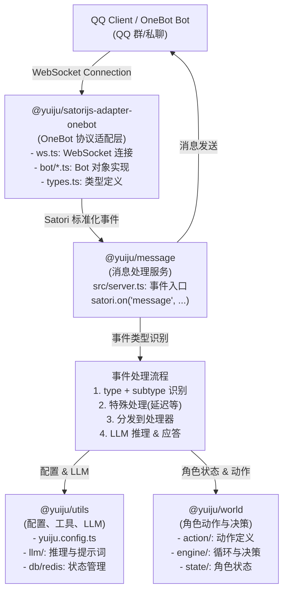
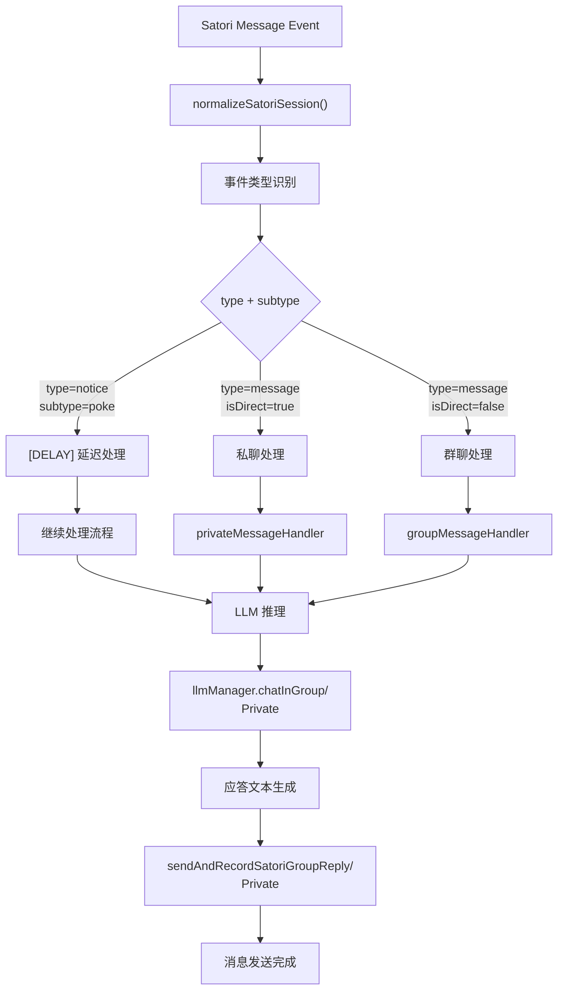
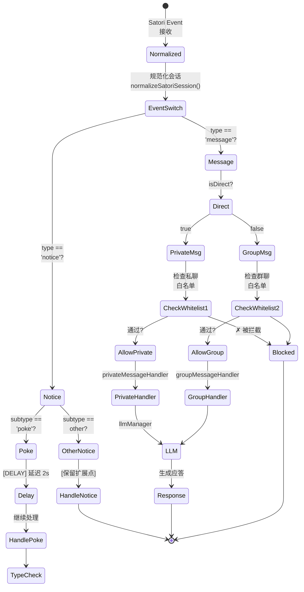
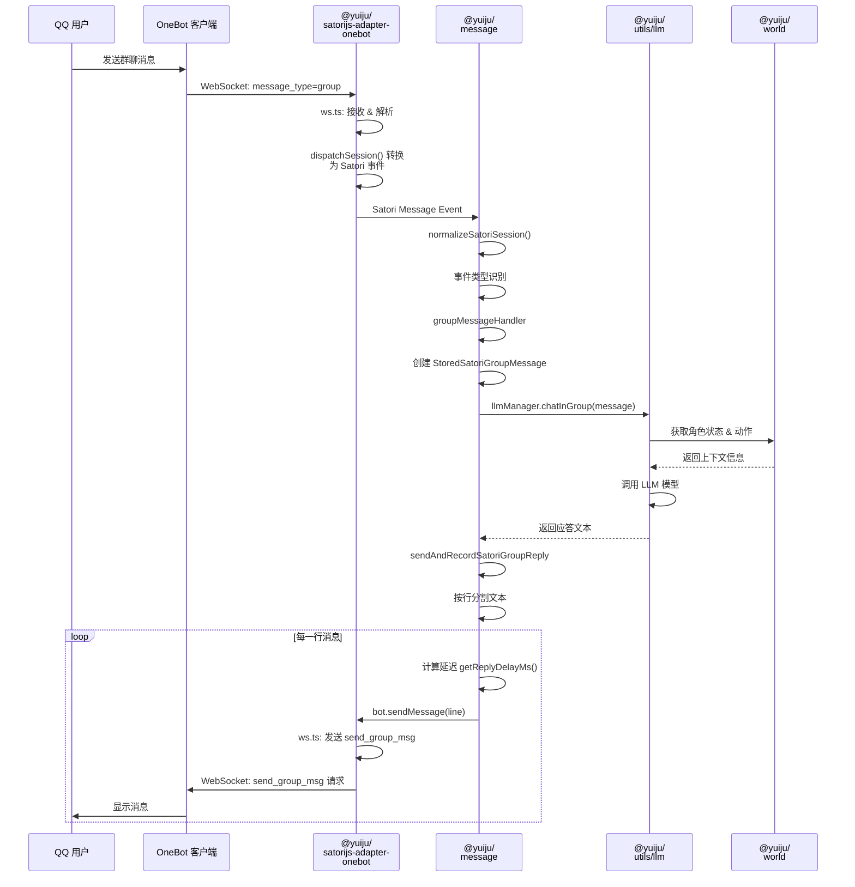
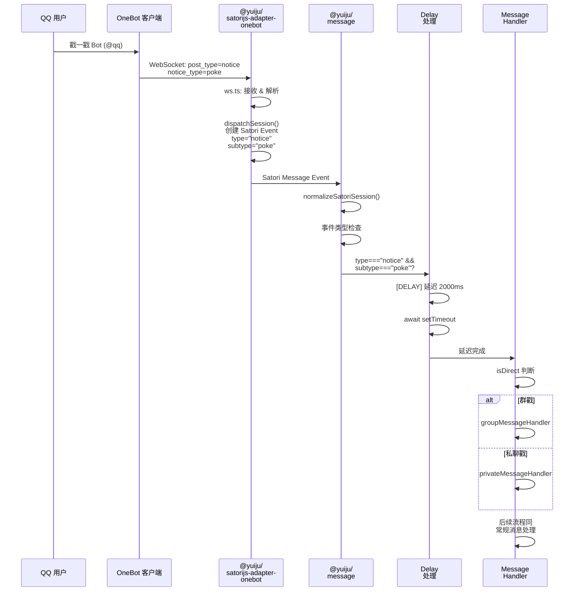
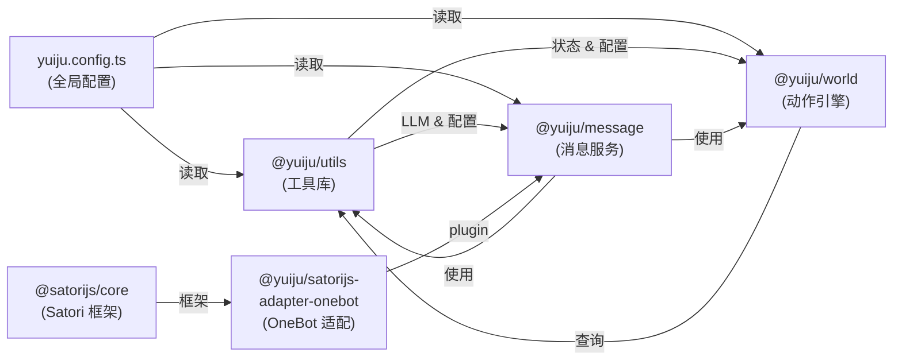
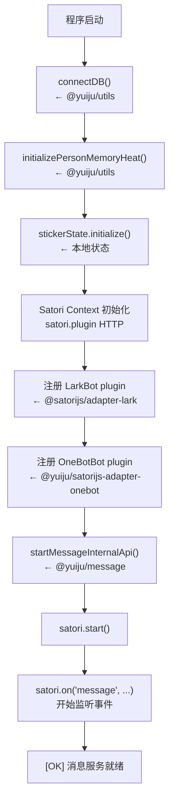

# QQ Bot 功能链路与包作用范围

## 概述

本文档说明 yuiju 系统中 QQ Bot（OneBot 协议）的功能链路、涉及的包模块以及各模块的职责边界。理解这份文档有助于未来对 QQ Bot 相关功能的快速定位与修改。

## 系统架构概览



## 各包的职责与边界

### 1. @yuiju/satorijs-adapter-onebot（OneBot 协议适配层）

**位置**: `packages/satorijs-adapter-onebot/`

**职责**:
- 建立与 OneBot 客户端（QQ bot 进程）的 WebSocket 连接
- 将 OneBot 协议消息转换为 Satori 标准格式
- 将 Satori 标准命令转换为 OneBot 协议后发送

**核心文件**:
- `src/ws.ts`: WebSocket 连接管理、请求响应匹配、超时处理
- `src/bot/base.ts`: Bot 基类，实现 Satori BaseBot 接口
- `src/bot/index.ts`: OneBotBot 类，扩展基类实现特定平台方法
- `src/types.ts`: OneBot 协议类型定义（Internal 方法、数据结构）
- `src/utils.ts`: 消息、用户、群组数据转换工具

**关键接口**:
```typescript
// 发出 OneBot 请求（内部使用）
Internal._request(action: string, params: Dict): Promise<Response>

// Satori 标准方法（外部调用）
bot.sendMessage(content, options)
bot.getMessage(messageId)
bot.createDirectChannel(userId)
```

**不负责的内容**:
- (N/A) 消息内容的解析与处理
- (N/A) LLM 推理与应答生成
- (N/A) 消息记录与持久化
- (N/A) 事件特殊处理（如延迟）

---

### 2. @yuiju/message（消息处理与应答服务）

**位置**: `packages/message/`

**职责**:
- 接收并规范化 Satori 消息事件
- 识别不同的消息类型与事件类型
- 实施事件特殊处理（如 poke 事件延迟）
- 协调 LLM 推理与消息发送
- 记录消息与交互历史

**核心文件**:
- `src/server.ts`: 
  - Satori Context 初始化
  - 消息事件入口：`satori.on("message", ...)`
  - 事件类型识别与特殊处理（**包括 poke 事件延迟**）
  - 消息分发到具体处理器

- `src/handler/group-message.ts`:
  - 群聊消息处理流程
  - 群白名单检查
  - LLM chatInGroup 调用
  - 应答文本生成与发送

- `src/handler/private-message.ts`:
  - 私聊消息处理流程
  - 私聊白名单检查
  - LLM 推理与应答

- `src/utils/message/`:
  - `reply.ts`: 消息发送与记录（sendAndRecordSatoriGroupReply, sendAndRecordSatoriPrivateReply）
  - `delay.ts`: 消息发送延迟计算（getReplyDelayMs）
  - `satori.ts`: Satori 会话标准化与消息创建

- `src/llm/manager.ts`: LLM 推理与对话管理

**关键流程 - 消息事件处理**:



**不负责的内容**:
- (N/A) OneBot 协议细节
- (N/A) LLM 模型加载与推理（委托给 llmManager）
- (N/A) 角色状态与动作管理

---

### 3. @yuiju/utils（共享工具与配置）

**位置**: `packages/utils/`

**职责**:
- 提供全局配置（yuiju.config.ts）
- LLM 管理与提示词模板
- 数据库连接与操作
- Redis 状态管理
- 类型定义与常量

**与消息系统相关的内容**:
- `src/config/`: 消息平台配置（OneBot, Lark）
- `src/llm/`: LLM 模型、提示词、推理接口
- `src/types/`: 消息类型、会话类型
- `src/db/`: 消息持久化 schema
- `src/redis/`: Redis 连接与操作

**配置结构**:
```typescript
// yuiju.config.ts
config.message = {
  onebot: {
    protocol: "ws",
    selfId: "QQ号",
    endpoint: "ws://...",
    retryTimes: 6,
    responseTimeout: 120000,
    whiteList: [QQ号],        // 私聊白名单
    groupWhiteList: [群号],    // 群聊白名单
  },
  proactive: {
    onebotGroupTargetId: 群号, // 主动消息目标群
  }
}
```

---

### 4. @yuiju/world（角色动作与世界模拟）

**位置**: `packages/world/`

**职责**:
- 角色状态与动作管理
- 事件循环与决策制定
- 主动消息生成与分发

**与消息系统的交互**:
- 接收消息回复结果作为角色状态变化的输入
- 生成主动消息并通过 `@yuiju/message` 的内部 API 发送
- 依赖消息历史用于 LLM 上下文

**不直接处理**:
- (N/A) OneBot 或 Lark 协议
- (N/A) 消息收发细节

---

## QQ Poke 事件延迟实现详解

### 需求背景
用户通过 QQ 戳一戳功能触发 bot 时，期望 bot 有短暂延迟后再响应，而不是立即回复。

### 实现位置
**文件**: `packages/message/src/server.ts` (lines 28-33)

```typescript
// 戳一戳事件延迟处理
if (normalizedSession.type === "notice" && normalizedSession.subtype === "poke") {
  const delayMs = 2000; // 延迟2秒
  logger.debug("[message.server] 检测到QQ戳一戳事件，延迟处理", { delayMs });
  await new Promise((resolve) => setTimeout(resolve, delayMs));
}
```

### 工作原理

1. **事件识别**:
   - Satori 规范化的会话对象包含 `type` 和 `subtype` 字段
   - OneBot 戳一戳事件被转换为 type="notice", subtype="poke"

2. **延迟实现**:
   - 在任何进一步处理前（包括 privateMessageHandler 的调用）设置延迟
   - 使用 `setTimeout` 在 Promise 中实现异步等待
   - 延迟时间（2 秒）可通过 yuiju.config.ts 配置调整（未来改进点）

3. **流程顺序**:
   ```
   Satori Message Event (poke event)
         ↓
   normalizeSatoriSession()
         ↓
   检测: type === "notice" && subtype === "poke"
         ↓
   延迟 2 秒 (await setTimeout)
         ↓
   继续处理消息 / 事件响应
   ```

### 为什么在 server.ts 而不是其他位置

- **server.ts** 是所有消息事件的唯一入口点
- 在此处理保证延迟对所有类型的 poke 事件有效
- 避免在多个处理器中重复实现相同逻辑
- 早期介入保证整个处理链路都会等待延迟完成

### 未来可配置化建议

当前延迟时间硬编码为 2000ms，可改进为：

```typescript
// 在 yuiju.config.ts 中添加
config.message.onebot.pokeDelayMs = 2000;

// 在 server.ts 中使用
const delayMs = config.message.onebot.pokeDelayMs;
```

### 事件类型路由图

事件从 Satori 进入后，根据 `type` 和 `subtype` 字段路由到不同的处理路径：



---

## 消息流向示例：群聊场景



---

## 消息流向示例：戳一戳事件场景



---

## 关键配置点

### OneBot 配置 (yuiju.config.ts)

```typescript
config.message.onebot = {
  // WebSocket 连接配置
  protocol: "ws",                    // 协议类型
  selfId: "123456789",               // Bot 的 QQ 号
  endpoint: "ws://127.0.0.1:5700",   // OneBot 客户端地址
  token: "secret_token",              // 认证 token

  // 重试与超时配置
  retryTimes: 6,                     // 连接失败重试次数
  retryInterval: 5000,               // 重试间隔 (ms)
  retryLazy: 60000,                  // 长期重试间隔 (ms)
  responseTimeout: 120000,           // OneBot 请求超时 (ms)

  // 访问控制
  whiteList: [123456, 789012],       // 私聊白名单 (QQ 号列表)
  groupWhiteList: [987654],          // 群聊白名单 (群号列表)
}

config.message.proactive = {
  onebotGroupTargetId: 987654,       // 主动消息发送的目标群号
}
```

### 日志点

主要日志由 logger.ts 输出，前缀 `[message.*]` 便于定位：

- `[message.server]`: server.ts 中的事件处理日志
- `[message.receive.group]`: 群聊消息接收日志
- `[message.receive.private]`: 私聊消息接收日志
- `[message.reply.group]`: 群聊消息发送日志
- `[message.reply.private]`: 私聊消息发送日志

---

## 常见修改场景

### 场景 1: 修改 Poke 事件延迟时间

**文件**: `packages/message/src/server.ts` (line 30)

```typescript
// 当前: const delayMs = 2000;
// 改为: const delayMs = 3000; // 延迟 3 秒
```

### 场景 2: 添加其他 notice 事件特殊处理

**文件**: `packages/message/src/server.ts` (line 29-33)

在 poke 事件检查后添加：
```typescript
if (normalizedSession.type === "notice" && normalizedSession.subtype === "group_recall") {
  // 处理群消息撤回事件
}
```

### 场景 3: 修改消息应答延迟

**文件**: `packages/message/src/utils/message/delay.ts`

修改 `getReplyDelayMs()` 函数调整消息发送间的延迟算法。

### 场景 4: 添加新的消息处理器或状态

**文件**: `packages/message/src/handler/` 新增文件

例如添加 `notice-handler.ts` 处理所有 notice 类型事件。

### 场景 5: 修改 OneBot 协议适配逻辑

**文件**: `packages/satorijs-adapter-onebot/src/`

- 修改类型转换: `types.ts` 或 `utils.ts`
- 修改 WebSocket 通信: `ws.ts`
- 修改方法实现: `bot/index.ts`

---

## 依赖关系与包加载顺序

### 包依赖关系图



### 启动顺序



---

## 调试建议

### 启用详细日志

环境变量设置:
```bash
NODE_ENV=development
LOG_LEVEL=debug
```

### 常见问题定位

| 现象 | 可能原因 | 检查点 |
|---|---|---|
| Bot 无法连接到 QQ | OneBot 客户端未启动 / 配置错误 | config.message.onebot.endpoint |
| 消息无法发送 | 群号或 QQ 号不在白名单 | groupWhiteList / whiteList |
| Poke 事件未延迟 | 事件类型识别失败 | 检查 type/subtype 值 |
| 消息应答缓慢 | LLM 推理耗时 | llmManager 日志 |
| 消息重复发送 | 请求重试机制 | ws.ts 中的 listener 管理 |

---

## 总结

理解 yuiju QQ Bot 功能链路的关键点：

1. **协议层** (@yuiju/satorijs-adapter-onebot): 封装 OneBot WebSocket 通信
2. **消息层** (@yuiju/message): 接收、规范化、分发、应答消息
3. **配置层** (@yuiju/utils): 集中管理所有平台与 LLM 配置
4. **决策层** (@yuiju/world): 生成角色动作与主动消息

每个包的职责清晰，修改时按需定位即可。欢迎参考本文档进行快速定位与改动！
