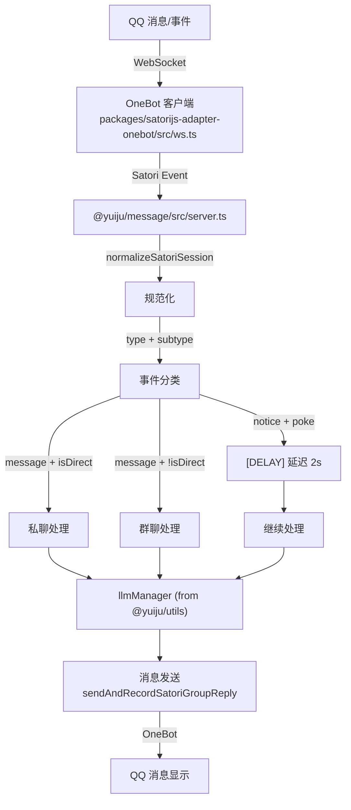

# QQ Bot 功能链路速查表

快速参考版本，详见 `docs/spec/qqbot-architecture.md`

## 包模块速查

| 包名 | 路径 | 职责 | 关键文件 |
|---|---|---|---|
| **satorijs-adapter-onebot** | `packages/satorijs-adapter-onebot/` | OneBot 协议适配 | `ws.ts`, `bot/index.ts`, `types.ts` |
| **@yuiju/message** | `packages/message/` | 消息处理与应答 | `server.ts`, `handler/*.ts` |
| **@yuiju/utils** | `packages/utils/` | 配置、LLM、数据库 | `config/`, `llm/` |
| **@yuiju/world** | `packages/world/` | 角色动作与决策 | `action/`, `engine/` |

## 消息事件流向



## 关键代码位置

### 戳一戳延迟
- **文件**: `packages/message/src/server.ts` (lines 28-33)
- **修改方式**: 改 `delayMs` 值或添加配置

### 消息应答延迟
- **文件**: `packages/message/src/utils/message/delay.ts`
- **函数**: `getReplyDelayMs(text: string): number`

### 事件类型识别
- **文件**: `packages/message/src/server.ts`
- **字段**: `normalizedSession.type`, `normalizedSession.subtype`

### OneBot 配置
- **文件**: `yuiju.config.ts`
- **字段**: `config.message.onebot.*`

## 常见修改场景

| 需求 | 文件位置 | 说明 |
|---|---|---|
| 修改 Poke 延迟时间 | `packages/message/src/server.ts:30` | 改 `const delayMs = 2000` |
| 修改消息间延迟算法 | `packages/message/src/utils/message/delay.ts` | 改 `getReplyDelayMs()` 函数 |
| 添加新的 notice 事件处理 | `packages/message/src/server.ts:29-33` | 仿照 poke 事件添加 if 分支 |
| 修改 OneBot 连接配置 | `yuiju.config.ts` | 改 `config.message.onebot.*` |
| 修改消息白名单 | `yuiju.config.ts` | 改 `whiteList` 或 `groupWhiteList` |
| 修改 OneBot 协议适配 | `packages/satorijs-adapter-onebot/src/` | 改类型转换或 WebSocket 逻辑 |

## 调试日志前缀

- `[message.server]` - 事件入口处理
- `[message.receive.group]` - 群聊接收
- `[message.receive.private]` - 私聊接收
- `[message.reply.group]` - 群聊发送
- `[message.reply.private]` - 私聊发送

## OneBot 配置示例

```typescript
config.message.onebot = {
  protocol: "ws",
  selfId: "123456789",           // Bot QQ 号
  endpoint: "ws://127.0.0.1:5700", // OneBot 客户端地址
  whiteList: [123456],           // 私聊白名单
  groupWhiteList: [987654],      // 群聊白名单
  responseTimeout: 120000,       // 请求超时
}
```

## 启动流程

```
src/server.ts: main()
  1. connectDB()
  2. initializePersonMemoryHeat()
  3. stickerState.initialize()
  4. startMessageInternalApi()
  5. satori.start()  ← 开始监听 message 事件
```

---

**完整说明文档**: 见 `docs/spec/qqbot-architecture.md`
